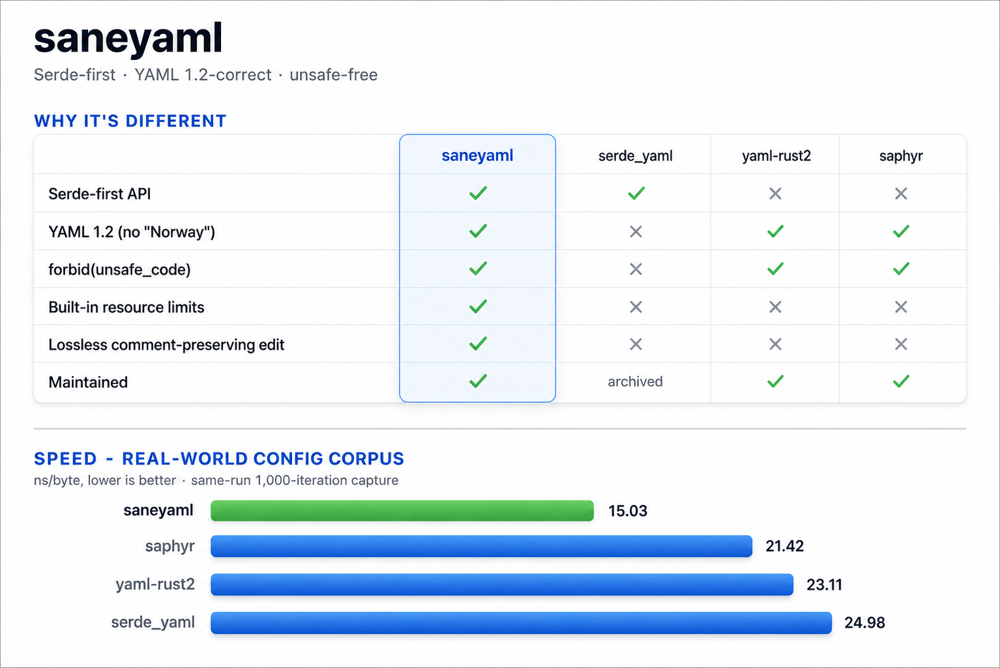

# saneyaml

[](https://github.com/jskoiz/saneyaml/actions/workflows/ci.yml)
[](LICENSE.md)
[](Cargo.toml)
[](src/lib.rs)

Serde-first YAML for Rust — load config straight into your structs with
`#[derive(Deserialize)]`, with **real YAML 1.2 semantics** (so `NO` stays the
string `"NO"`, not `false`), useful diagnostics, and resource limits built in.
Pure Rust, `#![forbid(unsafe_code)]`.

<p align="center">
  
</p>
<p align="center">
  <small>
    Static overview graphic. See
    <a href="docs/assets/saneyaml-overview.md">source notes and benchmark caveats</a>.
  </small>
</p>

## Install

```toml
[dependencies]
saneyaml = "0.1"
```

Then use it:

```rust
use serde::{Deserialize, Serialize};

#[derive(Deserialize, Serialize)]
struct Config {
    name: String,
    port: u16,
}

fn main() -> Result<(), saneyaml::Error> {
    let cfg: Config = saneyaml::from_str("name: web\nport: 8080\n")?;
    assert_eq!(cfg.port, 8080);

    let text = saneyaml::to_string(&cfg)?;
    println!("{text}");
    Ok(())
}
```

Coming from the archived `serde_yaml`? It's close to a drop-in — see
[MIGRATION.md](docs/MIGRATION.md).

## Why saneyaml

Most Rust YAML libraries make you pick one or the other: `serde_yaml`'s
ergonomics (now archived, and YAML 1.1-flavored), or a maintained YAML 1.2
parser like `yaml-rust2` or `saphyr` that hands you a node tree to walk by
hand. saneyaml is serde-first **and** YAML 1.2-correct.

- **Serde-first** — `from_str` / `from_slice` / `from_reader`, `to_string` /
  `to_writer`, and a `serde_yaml`-style `Value`. Deserialize straight into your
  config structs — no hand-walking a node tree.
- **YAML 1.2 by default** — correct scalar resolution, no "Norway problem":
  `NO`/`on`/`off`/`yes` stay strings. Opt into YAML 1.1 / `serde_yaml`-style
  resolution explicitly via schema modes (`Core`, `Json`, `Failsafe`,
  `LegacySerdeYaml`).
- **Diagnostics** — line/column, in-document key path (e.g. `server.port`),
  and opt-in source-caret rendering.
- **Safe on hostile input** — unsafe-free, with bounded time and memory:
  input-size, alias-expansion, nesting-depth, scalar-length, and
  collection-size limits.
- **Streaming and lossless editing** — pull-based streaming (`EventStream` /
  `DocumentStream`) and a lossless, comment-preserving editor.
- **Benchmarked** — real-world config corpus runs are tracked against
  `serde_yaml`, `yaml-rust2`, and `saphyr`; see [BENCHMARKS.md](docs/BENCHMARKS.md).

## Status

Pre-1.0 (`0.1.1`), MSRV Rust 1.88, and actively maintained. The public API is a
preview surface but is treated as SemVer-visible: breaking changes and MSRV
bumps are explicit, documented release decisions. The road to 1.0 is about
locking the surface down, not expanding it — stability is the goal.

## Documentation

- [MIGRATION.md](docs/MIGRATION.md) — `serde_yaml` migration cookbook + support matrix
- [COMPATIBILITY.md](docs/COMPATIBILITY.md) — schema modes, scalar resolution, divergences, threat model
- [ARCHITECTURE.md](docs/ARCHITECTURE.md) — crate layout and design
- [BENCHMARKS.md](docs/BENCHMARKS.md) · [SECURITY.md](SECURITY.md) · [CONTRIBUTING.md](CONTRIBUTING.md) · [CHANGELOG.md](CHANGELOG.md)

## License

MIT — see [LICENSE.md](LICENSE.md).
